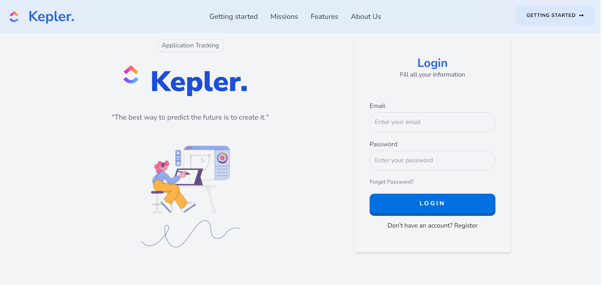
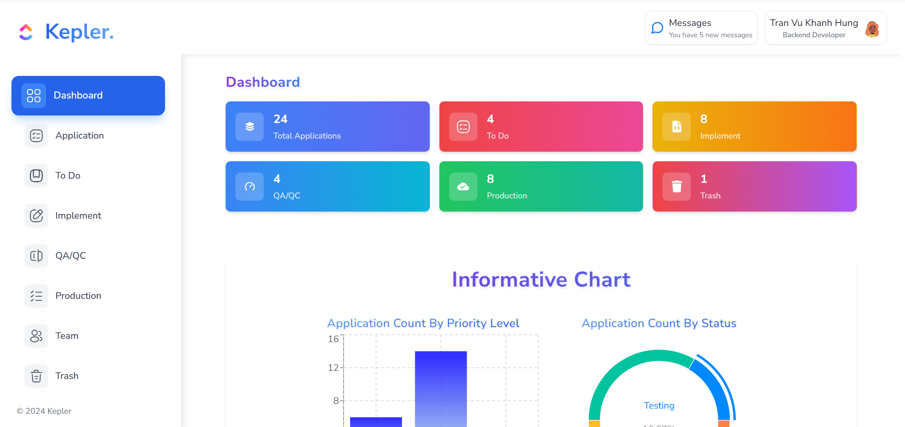

<div align="center">

  
  <h1>Kepler - An Application Tracking</h1>

  <p>
   "The best way to predict the future is to create it."
  </p>

 <!-- ## 🌟 About the Project -->

Kepler is a robust task tracking application designed to streamline project management and team collaboration. With a modern interface and advanced features, Kepler empowers teams to stay organized and productive.

<!-- Badges 
  <a href="https://github.com/Louis3797/awesome-readme-template/graphs/contributors">
    
  </a>
  <a href="">
    
  </a>
  <a href="https://github.com/Louis3797/awesome-readme-template/network/members">
    
  </a>
  <a href="https://github.com/Louis3797/awesome-readme-template/stargazers">
    
  </a>
  <a href="https://github.com/Louis3797/awesome-readme-template/issues/">
    
  </a>
  <a href="https://github.com/Louis3797/awesome-readme-template/blob/master/LICENSE">
    
  </a> -->
</p>

<h3>
    <a href="https://dotkepler.vercel.app/">View Demo</a>
  <span> · </span>
    <a href="https://drive.google.com/drive/folders/1AsCX11aeAtcip20aUPPfdWcBPl5QpVSO?usp=sharing">Report</a>
  <span> · </span>
    <a href="https://github.com/Khanhhungtran23/.Kepler-Task-Tracking-App-Server">Link Source Code Server</a>
  
  </h3>
</div>

<br />


<!-- About the Project -->

## :star2: About the Project

<!-- Screenshots -->

### :camera: Screenshots

<div align="center">
  
  
</div>

<!-- TechStack -->

### :space_invader: Tech Stack

<details>
  <summary>Client</summary>
  <ul>
    <li><a href="https://reactjs.org/">React.js</a></li>
    <li><a href="https://tailwindcss.com/">TailwindCSS</a></li>
    <li><a href="https://mui.com/">MUI</a></li>
    <li><a href="https://headlessui.com/">HeadlessUI</a></li>
  </ul>
</details>

<details>
  <summary>Server</summary>
  <ul>
    <li><a href="https://www.typescriptlang.org/">Typescript</a></li>
    <li><a href="https://expressjs.com/">Express.js</a></li>
    <li><a href="https://socket.io/">SocketIO</a></li>
    <li><a href="https://firebase.google.com/">Firebase</a></li>
  </ul>
</details>

<details>
<summary>Database</summary>
  <ul>
    <li><a href="https://redis.io/">Redis</a></li>
    <li><a href="https://www.mongodb.com/">MongoDB</a></li>
  </ul>
</details>

<!-- <details>
<summary>DevOps</summary>
  <ul>
    <li><a href="https://www.docker.com/">Docker</a></li>
    <li><a href="https://www.jenkins.io/">Jenkins</a></li>
    <li><a href="https://circleci.com/">CircleCLI</a></li>
  </ul>
</details> -->

<!-- Features -->

### 🎯 Features

Real-time updates: Stay in sync with live task tracking and updates.

User-friendly UI: Modern and intuitive design for seamless navigation.

Collaboration tools: Assign tasks, set deadlines, and track progress in teams

### 🌈 Future Enhancements

Integration with third-party tools such as Slack and Trello.

Enhanced analytics and reporting capabilities.

Mobile application development.

<!-- Color Reference -->


<!-- Env Variables -->

### :key: Environment Variables

To run this project, you will need to add the following environment variables to your .env file

`YOUR_API_KEY`

<!-- Getting Started -->

## :toolbox: Getting Started

<!-- Prerequisites -->

### :bangbang: Prerequisites

This project uses npm as package manager

<!-- Installation -->

### :gear: Installation

Install my-project with npm

```bash
  npm install
  cd task-tracking-app
```

<!-- Running Tests -->


### :running: Run Locally

Clone the project

```bash
  git clone https://github.com/leaser019/Task-Tracking-Application
```


Install dependencies

```bash
  npm install
```

Start the server

```bash
  npm start
```


