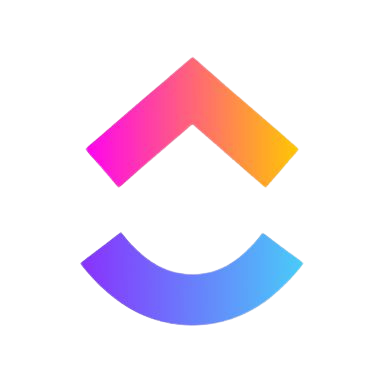

<div align="center">

  
  <h1>Kepler - An Application Tracking</h1>

  <p>
   "The best way to predict the future is to create it."
  </p>

<!-- Badges -->
  <a href="https://github.com/Louis3797/awesome-readme-template/graphs/contributors">
    
  </a>
  <a href="">
    
  </a>
  <a href="https://github.com/Louis3797/awesome-readme-template/network/members">
    
  </a>
  <a href="https://github.com/Louis3797/awesome-readme-template/stargazers">
    
  </a>
  <a href="https://github.com/Louis3797/awesome-readme-template/issues/">
    
  </a>
  <a href="https://github.com/Louis3797/awesome-readme-template/blob/master/LICENSE">
    
  </a>
</p>

<h4>
    <a href="https://dotkepler.vercel.app/">View Demo</a>
  <span> · </span>
    <a href="https://github.com/leaser019/Task-Tracking-Application">Documentation</a>
  <span> · </span>
    <a href="https://github.com/leaser019/Task-Tracking-Application/issues">Report Bug</a>
  <span> · </span>
    <a href="https://github.com/leaser019/Task-Tracking-Application/issues">Request Feature</a>
  </h4>
</div>

<br />

<!-- Table of Contents -->

# :notebook_with_decorative_cover: Table of Contents

- [About the Project](#star2-about-the-project)
  - [Screenshots](#camera-screenshots)
  - [Tech Stack](#space_invader-tech-stack)
  - [Features](#dart-features)
  - [Color Reference](#art-color-reference)
  - [Environment Variables](#key-environment-variables)
- [Getting Started](#toolbox-getting-started)
  - [Prerequisites](#bangbang-prerequisites)
  - [Installation](#gear-installation)
  - [Running Tests](#test_tube-running-tests)
  - [Run Locally](#running-run-locally)
  - [Deployment](#triangular_flag_on_post-deployment)
- [Usage](#eyes-usage)
- [Roadmap](#compass-roadmap)
- [Contributing](#wave-contributing)
  - [Code of Conduct](#scroll-code-of-conduct)
- [FAQ](#grey_question-faq)
- [License](#warning-license)
- [Contact](#handshake-contact)
- [Acknowledgements](#gem-acknowledgements)

<!-- About the Project -->

## :star2: About the Project

<!-- Screenshots -->

### :camera: Screenshots

<div align="center">
  
  
</div>

<!-- TechStack -->

### :space_invader: Tech Stack

<details>
  <summary>Client</summary>
  <ul>
    <li><a href="https://reactjs.org/">React.js</a></li>
    <li><a href="https://tailwindcss.com/">TailwindCSS</a></li>
    <li><a href="https://mui.com/">MUI</a></li>
    <li><a href="https://headlessui.com/">HeadlessUI</a></li>
  </ul>
</details>

<details>
  <summary>Server</summary>
  <ul>
    <li><a href="https://www.typescriptlang.org/">Typescript</a></li>
    <li><a href="https://expressjs.com/">Express.js</a></li>
    <li><a href="https://socket.io/">SocketIO</a></li>
    <li><a href="https://firebase.google.com/">Firebase</a></li>
  </ul>
</details>

<details>
<summary>Database</summary>
  <ul>
    <li><a href="https://redis.io/">Redis</a></li>
    <li><a href="https://www.mongodb.com/">MongoDB</a></li>
  </ul>
</details>

<!-- <details>
<summary>DevOps</summary>
  <ul>
    <li><a href="https://www.docker.com/">Docker</a></li>
    <li><a href="https://www.jenkins.io/">Jenkins</a></li>
    <li><a href="https://circleci.com/">CircleCLI</a></li>
  </ul>
</details> -->

<!-- Features -->

### :dart: Features

- Feature 1
- Feature 2
- Feature 3

<!-- Color Reference -->

### :art: Color Reference

| Color           | Hex                                                              |
| --------------- | ---------------------------------------------------------------- |
| Primary Color   |  #222831 |
| Secondary Color |  #393E46 |
| Accent Color    |  #00ADB5 |
| Text Color      |  #EEEEEE |

<!-- Env Variables -->

### :key: Environment Variables

To run this project, you will need to add the following environment variables to your .env file

`YOUR_API_KEY`

<!-- Getting Started -->

## :toolbox: Getting Started

<!-- Prerequisites -->

### :bangbang: Prerequisites

This project uses npm as package manager

<!-- Installation -->

### :gear: Installation

Install my-project with npm

```bash
  npm install
  cd task-tracking-app
```

<!-- Running Tests -->


### :running: Run Locally

Clone the project

```bash
  git clone https://github.com/leaser019/Task-Tracking-Application
```


Install dependencies

```bash
  npm install
```

Start the server

```bash
  npm start
```


